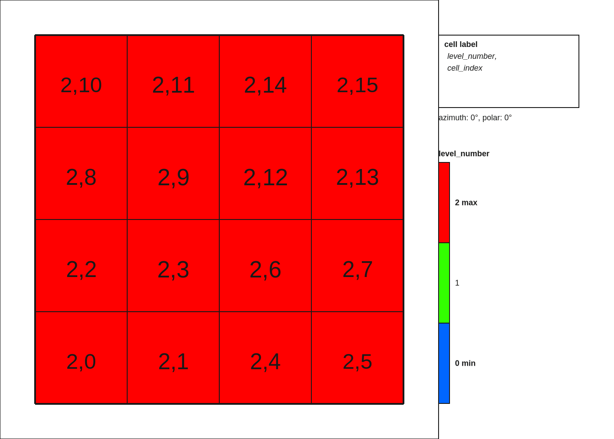

# Deal.II Course: Report by Costantino Pacilio
## Exercise 1: Create triangulation and print infos
File link: [step-1_mine.cc](lab01/step-1/step-1_mine.cc)

What I did: The above file modifies the original `step-1.cc` as follows:
- add a function `print_info`, which prints the following infos about a triangulation: `triangulation.n_levels()`, `triangulation.n_cells()`, and `triangulation.n_active_cells()`;
- add a function `third_grid()`, which creates an `hyper_ball` grid with 2 levels of global refinement.

## Exercise 2: Solve system and estimate error
File link: [step-3_v1.cc](lab03/step-3/step-3_v1.cc)

What I did: The file modifies the original `step-3.cc` as follows:
- increase to 3 the degree of the polynomial approximation;
- replace the RHS of the Laplacian eq. with the laplacian of the function `u(x,y)=sin(2*pi*x)sin(6*pi*y)`, in such a way that `u(x,y)` is the exact solution of the problem;
- modify the subroutine `solve` to interpolate the exact solution `u` at the finite element DOF's;

I also implemented a new subroutine `error_norms(const FunctionParser<dim>& fp) const`, which:
- computes the `L_p` norms of the error vector `sol-exact_sol`, for `p=1,2,infty`;
- via the `VectorTools::integrate_difference(...)` tool, computes the L2 norm as a weigthed sum at the quadrature points.

Moreover, I repeated the last task manually, to get confidence with the various `fe_values` tools, and I verified that my manual implementation is consistent with the built-in one.

## Exercise 3: Solve system with adaptive mesh
File link: [step-3_v2.cc](lab03/step-3/step-3_v2.cc)

What I did: This is an adaptove mesh version of `step-2_v1.cc`. The main changes are:
- replace the `make_grid()` function with `refine_grid()`, which estimates the error via the `KellyErrorEstimator<dim>::estimate`, and refines the grid accordingly;
- in `setup_system()`, manage the hanging node constraints via the `DpFTools::make_hanging_node_constarints` and `VectorTools::interpolate_boundary_values` tools;
- in `run()`, refine the grid progressively across `n = CYCLES` number of steps, where `CYCLES = 8` by default.

Here below I show the first, middle, and last step of gris refinement:

